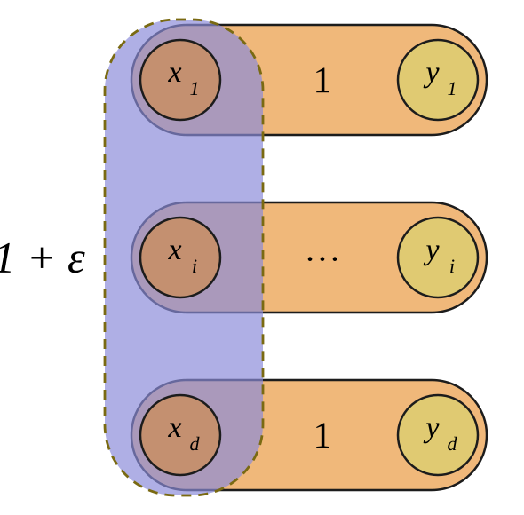
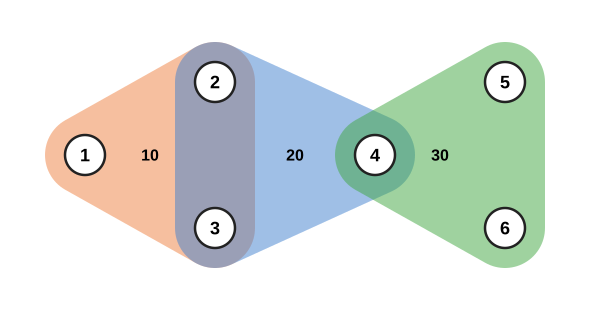
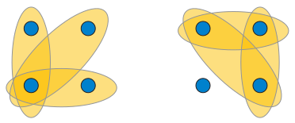
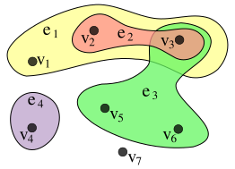
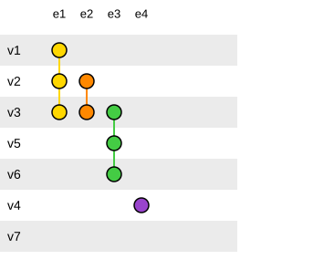
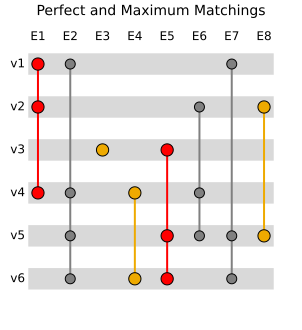
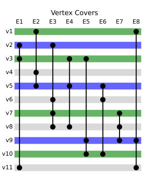

# SVG figures of various hypergraphs

## figure_lncs.svg

Create SVG figure that matches exactly the PDF figure in
`arXiv/arXiv-2602.22976/figure_lncs.pdf`.

Save it in this directory as `figure_lncs.svg`.

### Figure description

The figure illustrates the tight lower bound construction for the 1/d
approximation guarantee (Lemma 2 in the paper). It shows a hypergraph with 2d
vertices arranged in d rows. Each row contains a pair of vertices xᵢ and yᵢ
connected by a weight-1 hyperedge (depicted as a light orange pill-shaped
region). A single additional hyperedge of weight 1+ε (depicted as a blue dashed
rounded rectangle) connects all x vertices x₁, xᵢ, ..., x_d.

The local-max algorithm selects the heavy hyperedge of weight 1+ε, yielding a
matching of weight 1+ε. The optimal matching instead picks all d weight-1 pairs,
yielding weight d. The ratio (1+ε)/d → 1/d as ε → 0, showing the approximation
bound is tight.



## hypergraph-01.svg

A simple example hypergraph with 6 vertices and 3 weighted hyperedges: (1,2,3)
with weight 10, (2,3,4) with weight 20, and (4,5,6) with weight 30. Vertices are
drawn as white circles with numeric labels. Each hyperedge is depicted as a
semi-transparent rounded blob (fattened triangle) with its weight label shown
inside: (1,2,3) in orange, (2,3,4) in blue, (4,5,6) in green. Overlapping
regions are color-blended — orange+blue where hyperedges (1,2,3) and (2,3,4)
share vertices 2 and 3, and blue+green where (2,3,4) and (4,5,6) share vertex 4.

The layout is symmetric: vertices 1 and 4 are apex vertices on the left and
right, vertices 2,3 are shared between the first two hyperedges, and vertex 4 is
shared between the last two.



## Intersecting_set_families_2-of-4.svg



Two ways of constructing a family of subsets of `r` items out of `n`, such that
all subsets intersect each other and there are as many subsets as possible (
matching the bound of the [Erdős–Ko–Rado theorem](
https://en.wikipedia.org/wiki/Erd%C5%91s%E2%80%93Ko%E2%80%93Rado_theorem)):
left, a family formed by fixing one item `x` and choosing the other `r − 1`
items in all possible ways; right (for `n = 2r`), a family formed by avoiding
one item `x`
and choosing `r` of the remaining items in all possible ways. In this example,
`n = 4` and `r = 2`; the largest possible intersecting families of subsets have
three sets.

## Hypergraph-wikipedia.svg



An example of an undirected hypergraph with 7 vertices and 4 edges.

## PAOH_hypergraph_representation.svg



Alternative representation of the hypergraph reported in the figure above,
called PAOH. ([Parallel Aggregated Ordered Hypergraph Visualization](
https://hal.inria.fr/hal-02264960/file/Paohvis.pdf)) Edges are vertical lines
connecting vertices. `v7` is an isolated vertex. Vertices are aligned to the
left. The legend on the right shows the names of the edges.

## Hypergraph_matchings.svg



The red set of edges is a perfect matching because it contains every vertex of
the hypergraph. The yellow set is a maximum-cardinality matching, because it
contains the most number of edges possible for a matching in this hypergraph,
and the matching number is therefore 3.

In a regular graph, if one has a perfect matching, that same matching is also
the maximum-cardinality matching for the graph. However, in a hypergraph, where
the number of vertices connected by an edge is variable, they can be 2 distinct
matchings, as shown here.

## Vertex_covers_hypergraph.svg

<https://en.wikipedia.org/wiki/Vertex_cover_in_hypergraphs>

A vertex cover in a hypergraph is a set of vertices, such that every hyperedge
of the hypergraph contains at least one vertex of that set. It is an extension
of the notion of [vertex cover](
https://en.wikipedia.org/wiki/Vertex_cover) in a graph.



The set of blue vertices (vertices 2, 5, and 9) is a minimum vertex-cover, as
there are no smaller sets of vertices that are able to be a part of every
hyperedge. The vertex-coloring number of the graph is therefore 3, the number of
vertices in the minimum vertex-cover.

The set of green vertices (vertices 1, 3, 7, and 10) is a minimal vertex-cover,
as removing any vertex from this set makes the remaining set no longer a vertex
cover at all.

Note that the term [transversal](
https://en.wikipedia.org/wiki/Transversal_(combinatorics)
) would exclude the green set under its stricter definition, as edge 5 contains
both vertex 3 and 10.

## Tech Notes

Resume this session with:

```text
claude --resume e8e00ee8-135c-4892-9da0-b3bc048fa2a1
```
