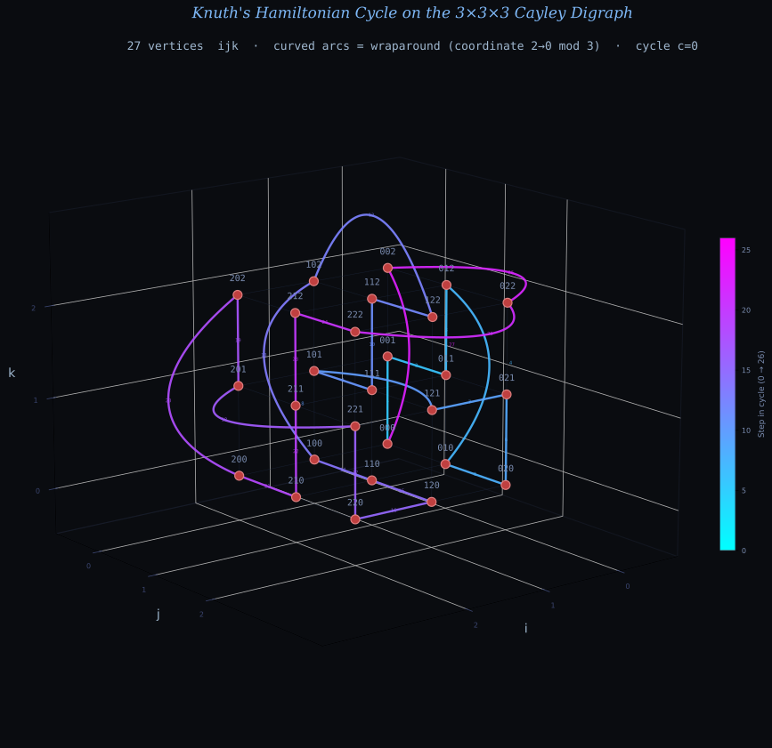
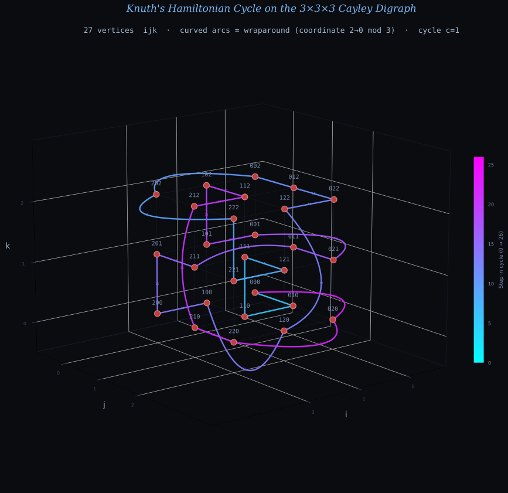
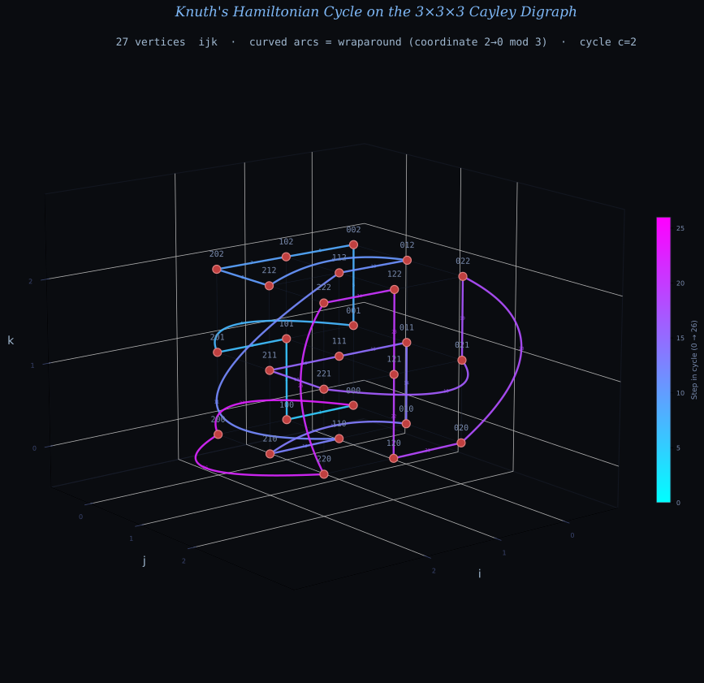

Knuth Claude Cycles
===================
March 6, 2026

[Claude’s Cycles](
https://www-cs-faculty.stanford.edu/~knuth/papers/claude-cycles.pdf
) by Don Knuth, Stanford Computer Science Department
(28 February 2026; revised 06 March 2026)

## Problem Statement

Label every point in an m×m×m grid with a triple *ijk*, where i, j, k each range
from 0 to m−1. From each point there are exactly three outgoing arrows: one that
increments i by 1, one that increments j by 1, and one that increments k by 1 (
all mod m, so the grid wraps around like a torus in each dimension).

**Goal:** Color each arrow red, green, or blue so that each color class forms a
single closed tour visiting all m³ points — i.e., decompose the arrows into
three Hamiltonian cycles, for all m > 2.

Because every point has exactly three outgoing and three incoming arrows (one
per coordinate), such a 3-coloring assigns a distinct color to each of the three
arrows leaving every point.

The case m = 2 is impossible. Knuth solved m = 3 by hand. Filip Stappers found
solutions empirically for m up to 16, making it highly plausible the
decomposition exists for all m > 2.

## Summary

This paper narrates how Claude Opus 4.6 solved the open odd-m case of this
combinatorial problem in about one hour of guided exploration, and how the
broader community then completed the picture.

**Claude’s approach (31 explorations in ~1 hour):**
Claude, guided by Filip Stappers, worked through a series of increasingly
sophisticated strategies:
- Reformulated as assigning a permutation σ: ℤ_m³ → S₃ at each vertex (routing
  each cycle through a different arc direction)
- Tried linear and cyclic assignment schemes — all failed
- Attempted brute-force DFS (too slow), then 2D and 3D "serpentine" patterns
  inspired by Gray codes
- Introduced a *fiber decomposition*: the map φ(i,j,k) = i+j+k mod m layers the
  graph into m fibers, each mapping to the next; this reduced the problem to
  choosing permutations per fiber
- Used simulated annealing to find solutions for small m, noticing a pattern: at
  each fiber the choice depends on only a single coordinate
- At exploration 31, produced a concrete Python construction valid for all odd m
  tested (3 to 101)

**The construction for cycle c=0:** At each vertex, compute s = (i+j+k) mod m,
then:
- s = 0: bump i if j = m−1, else bump k
- 0 < s < m−1: bump k if i = m−1, else bump j
- s = m−1: bump k if i = 0, else bump j

The three cycles are obtained by assigning a permutation d of {0,1,2} at each
vertex (choosing which arc direction each of the three cycles takes), where d
depends only on whether i, j, and s are 0, m−1, or intermediate.

**Show Knuth's solution for m=3:**
For m=3 the three cycles each visit all 27 vertices. (Starting from 000.)

**Cycle c=0** (bump i/j/k according to s and j):
```
000 → 001 → 011 → 012 → 010 → 020 → 021 → 121 → 101 →
111 → 112 → 122 → 102 → 100 → 110 → 120 → 220 → 221 →
201 → 202 → 200 → 210 → 211 → 212 → 222 → 022 → 002 → 000
```


**Cycle c=1** (s=0: bump j; s=1: bump i; s=2,i=0: bump j; s=2,i≠0: bump k):
```
000 → 010 → 110 → 111 → 121 → 221 → 222 → 202 → 002 →
012 → 022 → 122 → 120 → 100 → 200 → 201 → 211 → 011 →
021 → 001 → 101 → 102 → 112 → 212 → 210 → 220 → 020 → 000
```


**Cycle c=2** (s=0,j≠2: bump i; s=0,j=2: bump k; s=1,i≠2: bump k; s=1,i=2: bump
j; s=2: bump i):
```
000 → 100 → 101 → 201 → 001 → 002 → 102 → 202 → 212 →
012 → 112 → 110 → 210 → 010 → 011 → 111 → 211 → 221 →
021 → 022 → 020 → 120 → 121 → 122 → 222 → 220 → 200 → 000
```


Together the three cycles partition all 81 arcs of the 3×3×3 digraph: at each
vertex the three outgoing arcs (bump i, bump j, bump k) are assigned one to each
cycle.

See Python code that generates these figures in [fig-src/src](fig-src/src).

**Knuth’s proof:** Knuth verified the construction rigorously. The key insight
for the first cycle is that the first coordinate i changes only when s = 0 and
j = m−1, so all m² vertices with a given i occur consecutively. For odd m, the
third coordinate k advances by 2 (mod m) at each s = 0 step, cycling through all
residues since gcd(2, m) = 1. The Appendix covers the other two cycles.

**Generalizability and counting:** Knuth defines a Hamiltonian cycle for m = 3
as *generalizable*
if it lifts to a valid Hamiltonian cycle for all odd m ≥ 3 via a natural "fiber
coordinate" map. Of the 11,502 Hamiltonian cycles for m = 3, exactly 996 are
generalizable to all odd m. Of the 4,554 valid 3×3×3 decompositions, exactly 760
use only generalizable cycles — these are the
**"Claude-like" decompositions** valid for all odd m > 1. Claude’s solution is
one of these 760.

**Simpler construction (Reitbauer):** Shortly after, Maximilian Reitbauer found
an even simpler solution using only s and j (not i), with the identity
permutation "012" at almost every step.

**Even m:** The even case proved harder. Claude found empirical solutions for
m = 4, 6, 8 but no general construction. The problem for even m was eventually
resolved by:
- Ho Boon Suan, using code from gpt-5.3-codex (tested for all even m from 8 to
  200 and random values up to 2000), with a proof generated by GPT-5.4 Pro in a
  14-page paper [8]
- Keston Aquino-Michaels, who used joint GPT+Claude interaction to find an even
  simpler even-m decomposition and a thorough analysis of multi-agent
  problem-solving [12]

**Formal verification:** Kim Morrison (Lean community) formalized Knuth’s proof
of Claude’s construction in Lean, posted online March 4, 2026 [6].

**Significance:** The paper is a personal and celebratory account by Knuth of
watching an AI model solve a research-level combinatorial problem he had been
working on for weeks — making genuine mathematical progress through iterative
exploration, self-correction, and creative reformulation. Knuth calls it "a
dramatic advance in automatic deduction and creative problem-solving."
